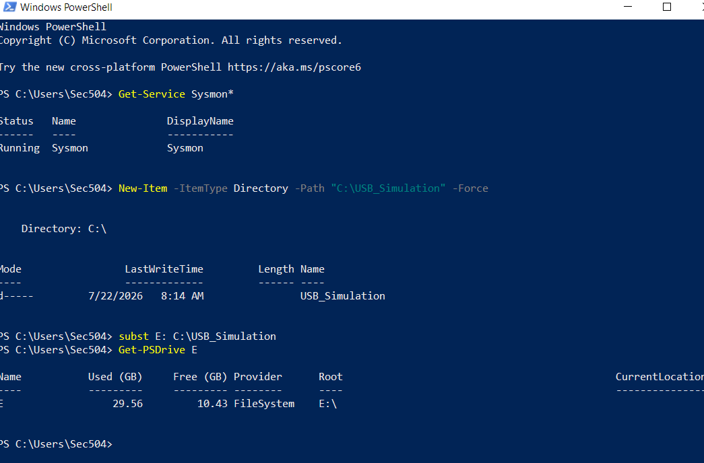
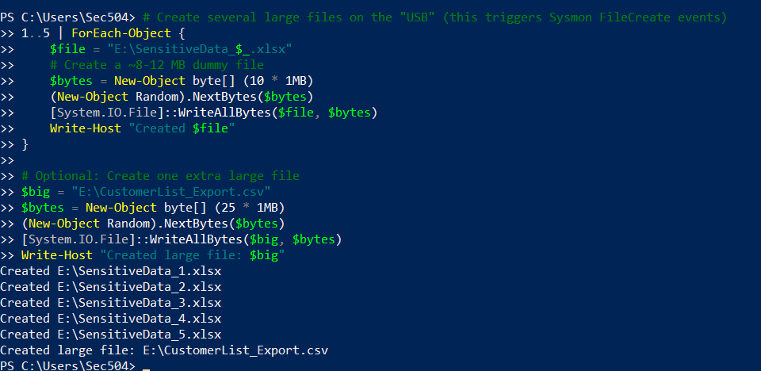
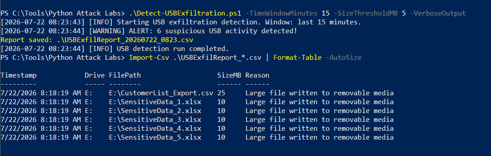
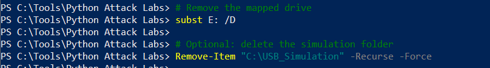

# Detect-USBExfiltration.ps1

**USB / Removable Media Exfiltration Detection**

## Overview
Detects potential insider data exfiltration via USB drives by monitoring Sysmon FileCreate events (Event ID 11) for large file writes to removable drive letters.

## Lab Testing (SANS SEC504 Windows 10)

**Setup**:
- Sysmon installed and running
- Simulated removable drive using folder mapping (`subst`)

**Simulation Steps**:

1. **Create simulation folder and map as removable drive**
   

2. **Generate large files on the simulated USB**
   

3. **Run the detection script**
   

4. **Cleanup mapped drive**
   

**Results**:
The script successfully detected **6 suspicious events** with clear reporting of file paths, sizes, and reasons.

## Usage Example
```powershell
.\Detect-USBExfiltration.ps1 -TimeWindowMinutes 15 -SizeThresholdMB 5 -VerboseOutput 
```
## MITRE ATT&CK Coverage
- T1052 — Exfiltration Over Physical Medium
- T1091 — Replication Through Removable Media

## Ethical Disclaimer
**For authorized lab and educational use only.**  
Unauthorized deployment or use is prohibited.
