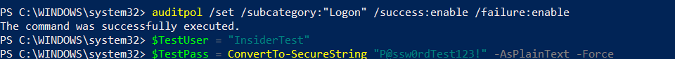
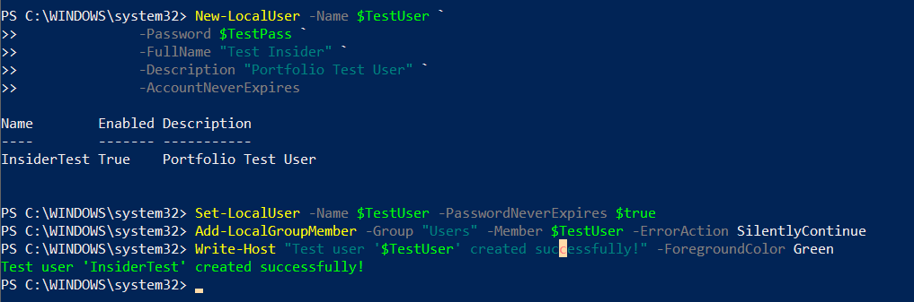
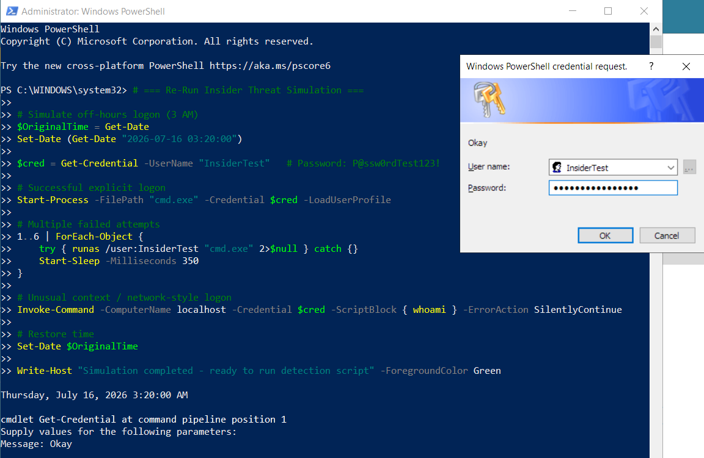
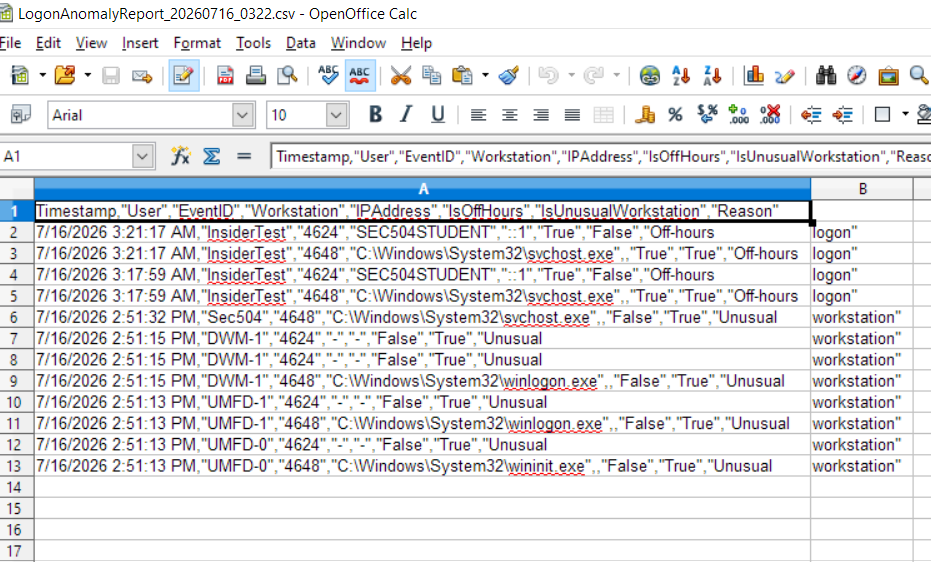

# Insider Threat Detection

Defensive security module focused on detecting insider threats in financial services environments.

## Overview
Practical detection engineering for anomalous user behavior using Windows Event Logs.

**Key Capability**: `Detect-LogonAnomalies.ps1` — identifies off-hours logons, unusual workstations, and failed logon spikes.

## Lab Testing (SANS SEC504 Windows 10)
All testing performed safely in an isolated virtual machine with synthetic data only.

## Tools
- **PowerShell**: `Detect-LogonAnomalies.ps1` (v2.1)
  - Efficient event log querying
  - Structured CSV reporting
  - Execution logging

## MITRE ATT&CK Coverage
- T1078 — Valid Accounts
- T1110 — Brute Force
- T1119 — Automated Collection

## Ethical Disclaimer
**For authorized lab and educational use only.**  
Unauthorized deployment or use is prohibited.

---

*Part of the [infosec-portfolio](../..) — PowerShell + Python defensive tooling.*